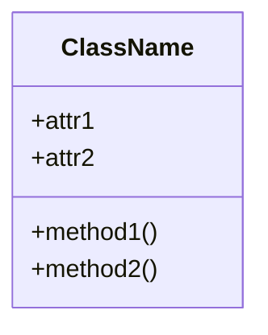
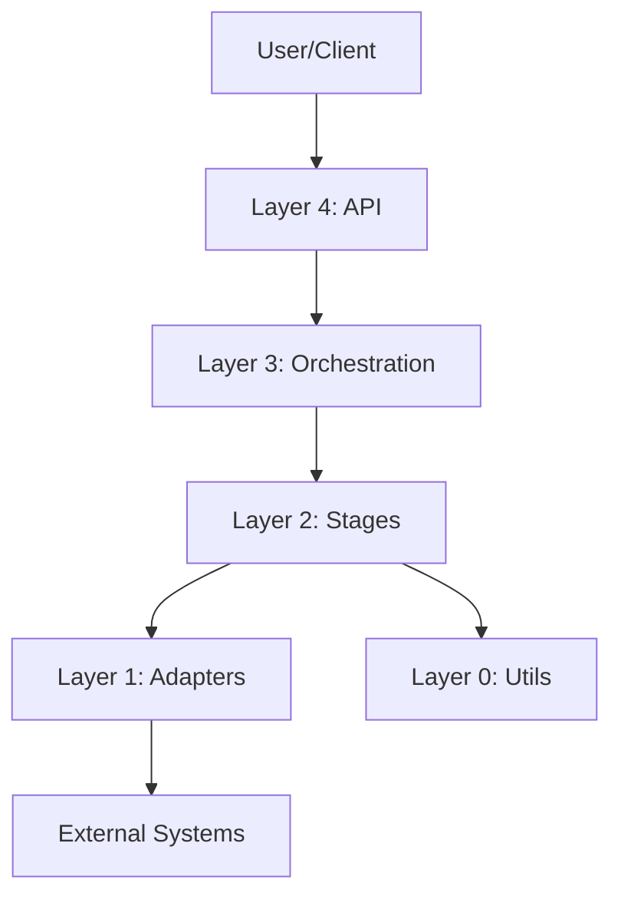
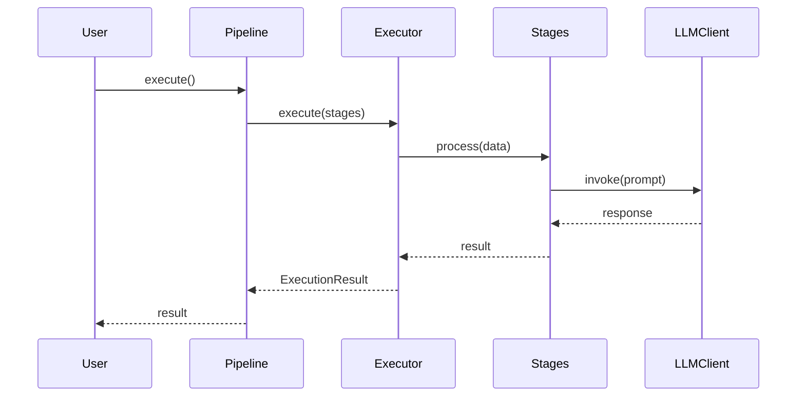
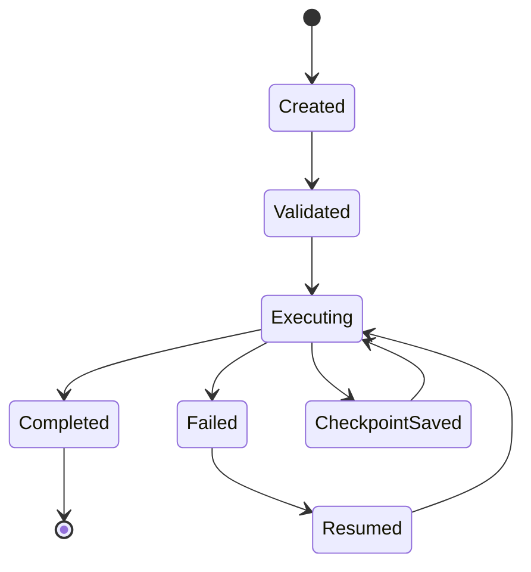
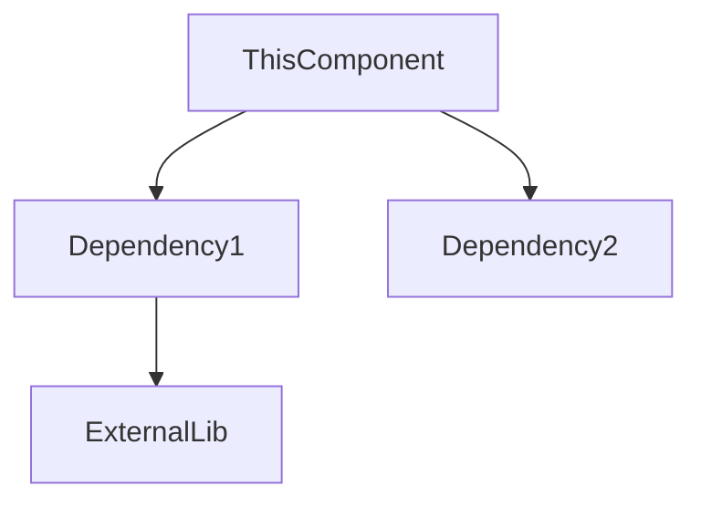
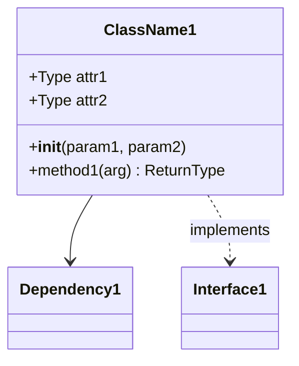
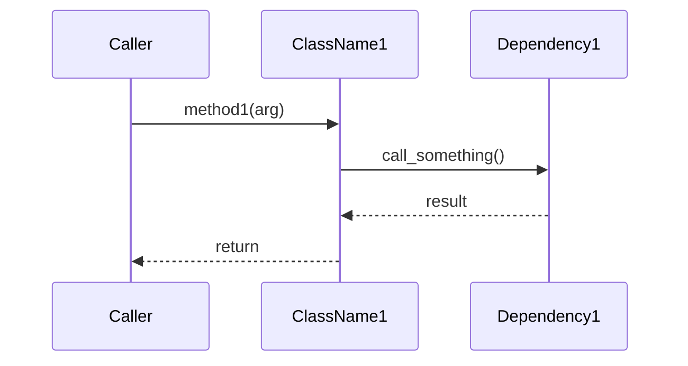

# 🔬 Technical Deep Dive Strategy

**Goal**: Create comprehensive technical documentation covering every component, class, function, and design decision in Hermes.

---

## 📋 **STRATEGY: Systematic Tracing Approach**

To ensure we don't miss anything, we'll use a **bottom-up + top-down hybrid approach**:

1. **Bottom-up**: Start from lowest-level utilities, build up to high-level API
2. **Top-down**: Trace execution flow from user API to implementation
3. **Cross-reference**: Document dependencies and interactions

---

## 🎯 **PHASE 1: Inventory & Classification**

### **Step 1.1: Complete File Inventory**

**Status**: ✅ **COMPLETE**

Total Python files: **47 files**

```
src/
├── __init__.py
├── adapters/        (4 files)
├── api/             (6 files)
├── cli/             (2 files)
├── config/          (2 files)
├── core/            (4 files)
├── integrations/    (3 files)
├── orchestration/   (9 files)
├── stages/          (10 files)
└── utils/           (8 files)
```

### **Step 1.2: Classify by Layer**

Following the 5-layer architecture:

| Layer | Directory | Files | Purpose |
|-------|-----------|-------|---------|
| **Layer 0: Utilities** | `utils/` | 8 | Cross-cutting concerns |
| **Layer 1: Adapters** | `adapters/` | 4 | External integrations |
| **Layer 2: Stages** | `stages/` | 10 | Processing logic |
| **Layer 3: Orchestration** | `orchestration/` | 9 | Execution control |
| **Layer 4: API** | `api/` | 6 | User-facing interfaces |
| **Config** | `config/` | 2 | Configuration loading |
| **Core** | `core/` | 4 | Data models |
| **CLI** | `cli/` | 2 | Command-line interface |
| **Integrations** | `integrations/` | 3 | Framework adapters |

---

## 🗺️ **PHASE 2: Documentation Structure**

We'll create **ONE comprehensive document** with this structure:

### **Proposed Document: `TECHNICAL_REFERENCE.md`**

```markdown
# Hermes - Technical Reference

## Part 1: Architecture Overview
- 5-Layer Architecture
- Design Principles (SOLID)
- Design Patterns Used
- Dependency Graph (Mermaid)

## Part 2: External Dependencies
- Library Inventory
- Why Each Library Was Chosen
- Version Requirements
- License Compatibility

## Part 3: Layer-by-Layer Deep Dive

### Layer 0: Core Utilities
- retry_handler.py
- rate_limiter.py
- cost_tracker.py
- budget_controller.py
- logging_utils.py
- metrics_exporter.py
- input_preprocessing.py

### Layer 1: Infrastructure Adapters
- llm_client.py
- data_io.py
- checkpoint_storage.py

### Layer 2: Processing Stages
- pipeline_stage.py (base)
- data_loader_stage.py
- prompt_formatter_stage.py
- llm_invocation_stage.py
- response_parser_stage.py
- result_writer_stage.py
- streaming_loader_stage.py
- multi_run_stage.py
- parser_factory.py

### Layer 3: Orchestration Engine
- execution_strategy.py
- sync_executor.py
- async_executor.py
- streaming_executor.py
- pipeline_executor.py
- execution_context.py
- state_manager.py
- observers.py

### Layer 4: High-Level API
- pipeline.py
- pipeline_builder.py
- pipeline_composer.py
- dataset_processor.py
- health_check.py

### Core Models
- specifications.py
- models.py
- error_handler.py

### Configuration
- config_loader.py

### CLI
- main.py

### Integrations
- airflow.py
- prefect.py

## Part 4: Execution Flows
- Pipeline Creation Flow
- Synchronous Execution Flow
- Async Execution Flow
- Streaming Execution Flow
- Error Handling Flow
- Checkpoint/Resume Flow

## Part 5: Data Flow
- Input → Processing → Output
- Cost Tracking Flow
- State Management Flow

## Part 6: Extension Points
- How to Add Custom Stages
- How to Add Custom Parsers
- How to Add Custom LLM Providers
- How to Add Custom Observers
```

---

## 🔍 **PHASE 3: Systematic Analysis Process**

### **For Each Component, Document:**

#### **1. Component Header**
```markdown
### 🔧 `component_name.py`

**Layer**: Layer X
**Purpose**: One-line description
**Dependencies**: List of imports
**Used By**: What depends on this
**Design Pattern**: Pattern applied (if any)
```

#### **2. Class/Function Inventory**
```markdown
#### Classes:
- `ClassName1` - Purpose
- `ClassName2` - Purpose

#### Functions:
- `function_name()` - Purpose
```

#### **3. Deep Dive Per Class**
```markdown
#### Class: `ClassName`

**Responsibility**: What does it do
**Attributes**:
- `attr1: Type` - Description
- `attr2: Type` - Description

**Methods**:
- `__init__()` - Initialization
- `method1()` - Purpose
- `method2()` - Purpose

**Design Decisions**:
- Why this approach?
- Alternatives considered?
- Trade-offs made?

**Code Example**:
```python
# Actual usage
```

**Mermaid Diagram**:

```

#### **4. Dependencies & Relationships**
```markdown
**Imports**:
- `module1` - Why needed
- `module2` - Why needed

**Depends On**:
- Component A - For what
- Component B - For what

**Used By**:
- Component C - How
- Component D - How
```

---

## 📊 **PHASE 4: Comprehensive Diagrams**

### **Diagrams to Create:**

#### **1. System Architecture (High-Level)**


#### **2. Class Diagram (All Components)**
```mermaid
classDiagram
    Pipeline --> PipelineExecutor
    PipelineExecutor --> ExecutionStrategy
    ExecutionStrategy <|-- SyncExecutor
    ExecutionStrategy <|-- AsyncExecutor
    ExecutionStrategy <|-- StreamingExecutor
    Pipeline --> PipelineStage
    PipelineStage <|-- DataLoaderStage
    PipelineStage <|-- LLMInvocationStage
    ... (all classes)
```

#### **3. Sequence Diagram (Execution Flow)**


#### **4. State Diagram (Pipeline States)**


#### **5. Component Dependency Graph**
```mermaid
graph LR
    Pipeline --> PipelineBuilder
    Pipeline --> Specifications
    Pipeline --> PipelineExecutor
    PipelineExecutor --> ExecutionContext
    PipelineExecutor --> StateManager
    PipelineExecutor --> Observers
    ... (all dependencies)
```

#### **6. Data Flow Diagram**


---

## 🔬 **PHASE 5: Detailed Analysis Checklist**

### **For Each File, Ensure We Document:**

- [ ] **File purpose and role**
- [ ] **All classes defined**
- [ ] **All functions defined**
- [ ] **All type hints explained**
- [ ] **All imports and why needed**
- [ ] **Design patterns used**
- [ ] **SOLID principles applied**
- [ ] **Thread safety considerations**
- [ ] **Error handling approach**
- [ ] **Performance considerations**
- [ ] **Memory management**
- [ ] **Extensibility points**
- [ ] **Backwards compatibility**
- [ ] **Test coverage status**
- [ ] **Known limitations**
- [ ] **Future improvements**

---

## 📚 **PHASE 6: Library Analysis**

### **Document Each Dependency:**

| Library | Version | Purpose | Alternatives | Why Chosen |
|---------|---------|---------|--------------|------------|
| `llama-index` | >=0.12.0 | LLM abstraction | LangChain, direct API | Multi-provider, mature |
| `pandas` | >=2.0.0 | DataFrame manipulation | polars only | Industry standard |
| `polars` | >=0.20.0 | Fast parquet reading | pandas only | Performance |
| `pydantic` | >=2.0.0 | Data validation | dataclasses | Validation + serialization |
| `tqdm` | >=4.66.0 | Progress bars | rich.progress | Simple, widely used |
| `tenacity` | >=8.2.0 | Retry logic | backoff | More flexible |
| `structlog` | >=24.0.0 | Structured logging | standard logging | JSON output |
| `click` | >=8.1.0 | CLI framework | argparse, typer | Decorator-based |
| `rich` | >=13.0.0 | Terminal formatting | colorama | Beautiful tables |
| `tiktoken` | >=0.5.0 | Token counting | transformers | Fast, OpenAI-native |

---

## 🎯 **PHASE 7: Execution Flow Tracing**

### **Trace Each User Journey:**

#### **Journey 1: Simple Pipeline Execution**
```python
# User code
pipeline = PipelineBuilder.create() \
    .from_csv("data.csv", input_columns=["text"], output_columns=["result"]) \
    .with_prompt("Process: {text}") \
    .with_llm(provider="groq", model="llama-3.3-70b") \
    .build()

result = pipeline.execute()
```

**Execution Trace**:
1. `PipelineBuilder.create()` → Creates builder instance
2. `.from_csv()` → Sets DatasetSpec
3. `.with_prompt()` → Sets PromptSpec
4. `.with_llm()` → Sets LLMSpec
5. `.build()` → Creates Pipeline with all specs
6. `.execute()` → Calls PipelineExecutor
7. Executor creates stages from specs
8. Executor runs each stage sequentially
9. Returns ExecutionResult

**Components Involved**:
- PipelineBuilder
- Pipeline
- DatasetSpec, PromptSpec, LLMSpec
- PipelineExecutor
- SyncExecutor
- DataLoaderStage, PromptFormatterStage, LLMInvocationStage, ResponseParserStage
- LLMClient
- CostTracker
- ExecutionContext

#### **Journey 2: Error Handling with SKIP Policy**
Trace what happens when LLM call fails...

#### **Journey 3: Checkpoint & Resume**
Trace checkpoint saving and resuming...

#### **Journey 4: Async Execution**
Trace async/await flow...

#### **Journey 5: Streaming Large File**
Trace streaming execution...

---

## 🔍 **PHASE 8: Cross-Cutting Concerns**

### **Document How These Work Across Components:**

1. **Error Handling**
   - Where errors are raised
   - How they propagate
   - Error recovery strategies
   - Error policies (SKIP, FAIL, RETRY, USE_DEFAULT)

2. **Cost Tracking**
   - Where costs are recorded
   - How they accumulate
   - Budget enforcement
   - Cost estimation

3. **State Management**
   - What state is tracked
   - Where state lives
   - Checkpoint creation
   - Resume logic

4. **Observability**
   - Logging points
   - Progress tracking
   - Metrics collection
   - Observer notifications

5. **Thread Safety**
   - Which components use locks
   - Race condition prevention
   - Concurrent execution safety

6. **Configuration**
   - How config flows through system
   - Validation points
   - Defaults and overrides

---

## 📝 **PHASE 9: Code Analysis Tools**

### **Use These to Ensure Completeness:**

```bash
# 1. Count total lines of code
find src -name "*.py" -exec wc -l {} + | tail -1

# 2. List all classes
grep -r "^class " src --include="*.py" | wc -l

# 3. List all functions
grep -r "^def " src --include="*.py" | wc -l

# 4. Find all design patterns
grep -r "ABC\|abstractmethod\|@dataclass\|Protocol" src --include="*.py"

# 5. Find all type hints
grep -r "def.*->.*:" src --include="*.py" | head -20

# 6. Find all imports
grep -r "^import\|^from" src --include="*.py" | sort | uniq

# 7. Detect complexity
# (files with > 300 lines might need extra attention)
find src -name "*.py" -exec wc -l {} + | sort -rn | head -10
```

---

## 📊 **PHASE 10: Documentation Template**

### **Template for Each Component:**

```markdown
---

## 🔧 `src/path/to/component.py`

### **Overview**

| Attribute | Value |
|-----------|-------|
| **Layer** | Layer X: Name |
| **Purpose** | Single-line purpose |
| **LOC** | XXX lines |
| **Complexity** | Low/Medium/High |
| **Test Coverage** | XX% |
| **Last Modified** | Date |

### **Responsibility**

What does this component do? Why does it exist?

### **Dependencies**



**External Libraries**:
- `library1` - Purpose
- `library2` - Purpose

**Internal Dependencies**:
- `module1` - Purpose
- `module2` - Purpose

### **Classes**

#### `ClassName1`

**Purpose**: What it does

**Attributes**:
```python
attr1: Type  # Description
attr2: Type  # Description
```

**Methods**:

##### `__init__(param1: Type, param2: Type)`
Initialization logic

**Parameters**:
- `param1`: Description
- `param2`: Description

**Raises**:
- `ValueError`: When...

##### `method1(arg: Type) -> ReturnType`
Method purpose

**Parameters**:
- `arg`: Description

**Returns**:
- `ReturnType`: Description

**Example**:
```python
obj = ClassName1(param1="value", param2=123)
result = obj.method1("test")
```

**Algorithm**:
1. Step 1
2. Step 2
3. Step 3

**Time Complexity**: O(n)
**Space Complexity**: O(1)

**Design Decisions**:
- Why this approach?
- Trade-offs?
- Alternatives considered?

### **Class Diagram**



### **Sequence Diagram**



### **Usage Examples**

#### Basic Usage:
```python
# Simple example
```

#### Advanced Usage:
```python
# Complex example
```

### **Thread Safety**

- [ ] Thread-safe
- [ ] Not thread-safe
- [ ] Conditional (explain)

**Mechanisms**: Locks, immutability, etc.

### **Error Handling**

**Exceptions Raised**:
- `ExceptionType1`: When...
- `ExceptionType2`: When...

**Exceptions Caught**:
- `ExceptionType3`: Handled by...

### **Testing**

**Test Files**: `tests/unit/test_component.py`
**Coverage**: XX%

**Test Cases**:
- [ ] Happy path
- [ ] Edge cases
- [ ] Error conditions
- [ ] Thread safety
- [ ] Performance

### **Performance Considerations**

- Time complexity: O(?)
- Space complexity: O(?)
- Bottlenecks: What to watch
- Optimizations: What was done

### **Extension Points**

How to extend or customize this component.

### **Known Limitations**

- Limitation 1
- Limitation 2

### **Future Improvements**

- [ ] Improvement 1
- [ ] Improvement 2

### **Related Components**

- `ComponentA` - Relationship
- `ComponentB` - Relationship

---
```

---

## ✅ **EXECUTION PLAN**

### **Order of Analysis (Bottom-Up):**

1. **Week 1: Foundation (Layer 0 + Core)**
   - [ ] `utils/` - All 8 utility modules
   - [ ] `core/` - Models, specs, error handler
   - [ ] Document libraries used

2. **Week 2: Infrastructure (Layer 1 + Config)**
   - [ ] `adapters/` - LLM client, data I/O, checkpoints
   - [ ] `config/` - Config loader
   - [ ] Create dependency diagrams

3. **Week 3: Processing (Layer 2)**
   - [ ] `stages/` - All 10 stage modules
   - [ ] Create data flow diagrams

4. **Week 4: Orchestration (Layer 3)**
   - [ ] `orchestration/` - All 9 orchestration modules
   - [ ] Create execution flow diagrams

5. **Week 5: API & Integrations (Layer 4)**
   - [ ] `api/` - All 6 API modules
   - [ ] `cli/` - CLI implementation
   - [ ] `integrations/` - Framework adapters
   - [ ] Create sequence diagrams

6. **Week 6: Flows & Polish**
   - [ ] Trace all execution flows
   - [ ] Create comprehensive architecture diagram
   - [ ] Create state diagrams
   - [ ] Review and fill gaps
   - [ ] Add cross-references

---

## 🎯 **SUCCESS CRITERIA**

### **The Technical Reference Should:**

- [ ] Document all 47 Python files
- [ ] Explain all classes (estimate: 80+ classes)
- [ ] Explain all public methods (estimate: 300+ methods)
- [ ] Include 20+ Mermaid diagrams
- [ ] Trace 10+ execution flows
- [ ] List all 20+ dependencies with rationale
- [ ] Explain all design patterns used
- [ ] Show SOLID principles application
- [ ] Include code examples for each component
- [ ] Document all extension points
- [ ] Cover threading and concurrency
- [ ] Explain error handling strategy
- [ ] Document cost tracking mechanism
- [ ] Explain state management
- [ ] Cover all configuration options

### **Metrics:**

- **Completeness**: 100% of components covered
- **Depth**: Each component has >= 200 words
- **Diagrams**: At least 1 diagram per complex component
- **Examples**: At least 1 example per public class
- **Cross-references**: All dependencies linked

---

## 🚀 **NEXT STEPS**

1. **Create the document skeleton**:
   ```bash
   touch docs/TECHNICAL_REFERENCE.md
   ```

2. **Start with Layer 0 (utils/)**:
   - Begin with simplest components
   - Build up complexity

3. **Use automated tools**:
   - Generate class/function inventory
   - Extract docstrings
   - Analyze imports

4. **Iterate**:
   - Write component documentation
   - Add diagrams
   - Review and refine

---

**Ready to start? Let's begin with Layer 0! 🚀**
